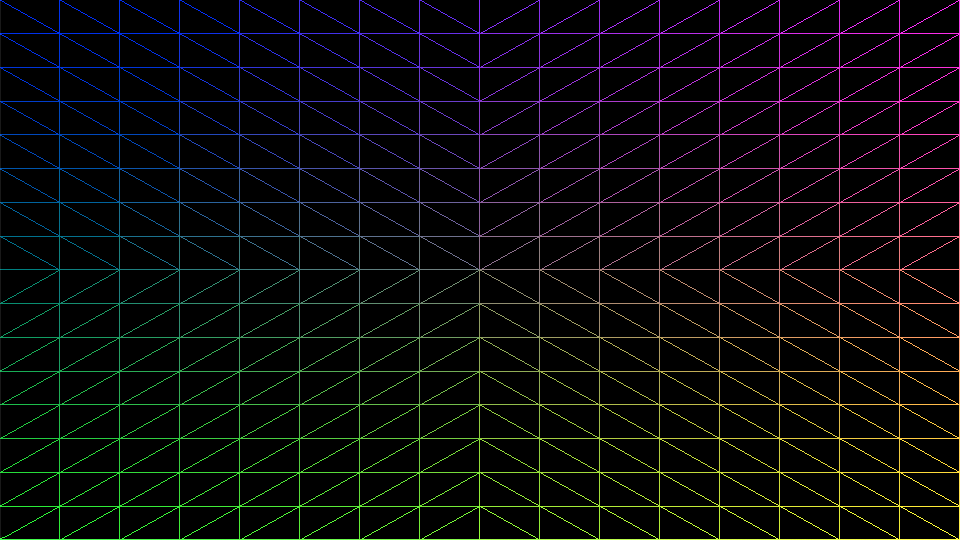

# Tessellation

### MetalBasicTessellation

	$ cd ./MetalBasicTessellation 

##### Build MSL

	$ xcrun -sdk macosx metal -c TessellationFunctions.metal -o TessellationFunctions.air; xcrun -sdk macosx metallib TessellationFunctions.air -o TessellationFunctions.metallib

##### Build Command Line Tool & Run
	
	$ xcrun clang++ -ObjC++ -lc++ -fobjc-arc -O3 -std=c++17 -Wc++17-extensions -framework Cocoa -framework MetalKit -framework Metal ./MetalBasicTessellation.mm -o MetalBasicTessellation
	$ ./MetalBasicTessellation
	
	